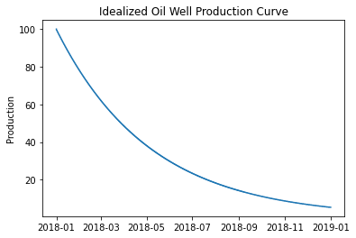
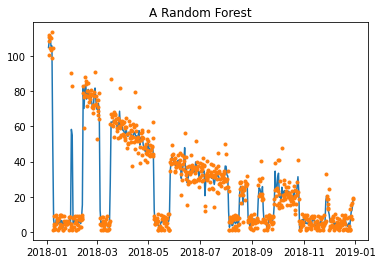
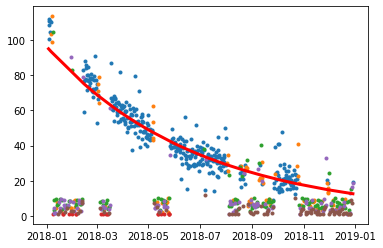

# Production Modeling

## Goal

The goal of this project is to demonstrate how unsupervised and supervised learning can be combined to solve a time-series modeling problem

## Problem Statement

Our model system is an oil well, or any type of system that deviates from ideal production.

An ideal production system might show a production over time curve as shown:

However, under real world conditions, a curve like this is never achived. A real production curve is likely to show periods of normal production, interspersed with both high and low production, and occasional periods of zero production.

Our goal is to fit an idealized production curve to this realistic data so that an operator can be notifed if production falls below expectations and can initiate maintenace.

## Approach

Tradtional approaches to fit a line to the data are not appropriate in this scenario because they may follow the declining production.

This Random Forest fit is not helpful becasue it fits to both the periods of normal and abnormal production. It does not distinguish between them. We don't want to know what the actual production is; we want to identify the difference between actual production and ideal production. 

To do that, we need to segment the data into several clusters, representing the various production modes (normal, high, low, zero). Each data point in the curve can be identifed as as belonging to one of these various modes of production, however, we don't have any labels to indicate that. Therefore, we first need to use unsupervised learning first to cluster the data and then supervised learning to fit a curve only to the periods of normal produciton.

## Results

We show how unsupervised learning can be used along with supervised learning and simple physical models to model production levels under ideal conditions and therefore identify periods where production falls below expectations and maintenance is required.

See [Production Modeling.ipynb](Production Modeling.ipynb) for example code.